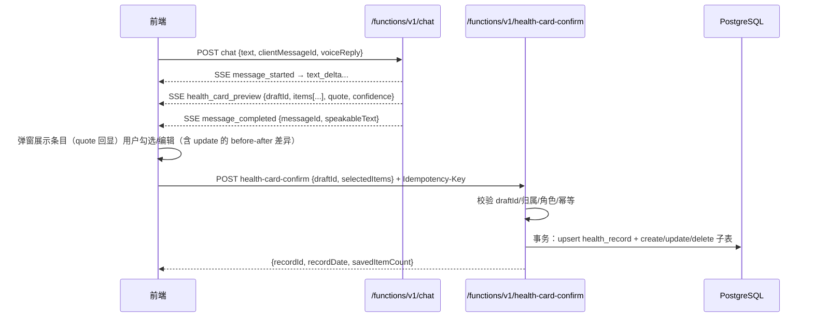
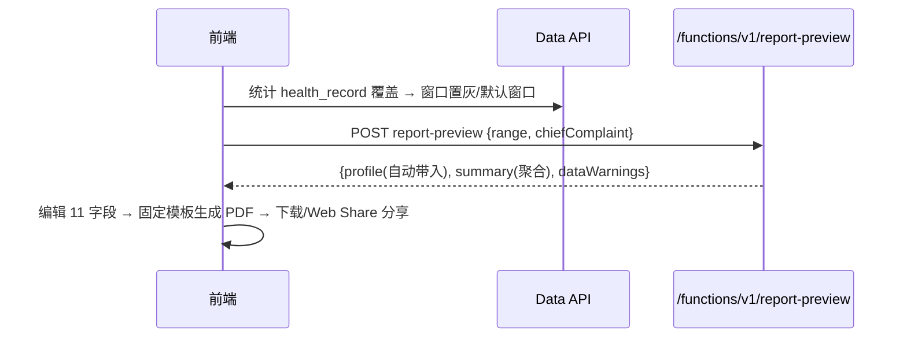
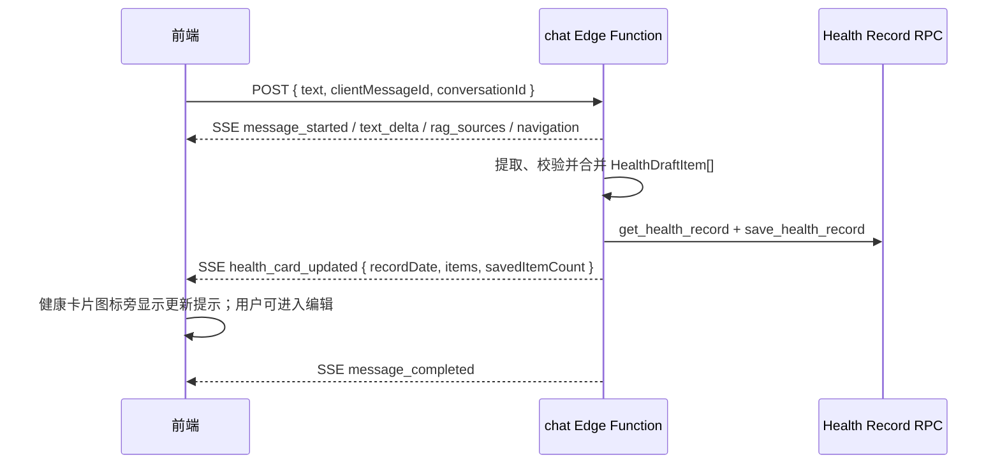

# 前后端接口设计（MVP · Demo 版 · Vercel + Supabase）

| 版本 | 编辑人 | 修改记录 |
| ---- | ------ | -------- |
| v0.1 | ``     | 初稿（自定义 REST 形态） |
| v0.2 | ``     | 架构确定为 Vercel + Supabase；冻结核心契约（chat SSE / 卡片草案 Schema / health-card-confirm / ASR / report-preview / 角色错误码） |
| v0.3 | Codex | 当前实现修订：聊天完成后自动提取、校验并写入健康卡片；`health_card_updated` 为主事件 |

> 依据文档：《产品需求文档.md》《健康信息提取原则.md》《健康卡片.md》
>
> 已确认架构决策：
> 1. **Vercel 只部署前端，不做 API 中转**；
> 2. 前端直连 Supabase 三通道：**Auth**（登录/注册/Session）、**Data API**（普通数据查询）、**Edge Functions**（AI、ASR、TTS、健康卡片确认、报告预览）；
> 3. 所有登录后请求携带 `Authorization: Bearer <supabase_access_token>`；
> 4. **AI 聊天自动更新健康记录**：聊天服务提取并校验用户明确事实后，调用 `save_health_record` 写入；前端以 `health_card_updated` 提示用户并保留全量手动编辑能力。旧 `health-card-confirm` 仅保留兼容；
> 5. **报告 PDF 由前端生成**（固定模板），MVP 无后端导出接口、不保存最终 PDF；
> 6. 用户角色 `self_user | supporter`：健康数据接口对 supporter 返回 `403 ROLE_NOT_ALLOWED`，**RLS 与 Edge Function 双重校验**，不能只依赖前端隐藏按钮。

---

## 〇、契约冻结优先级

以下契约为 **🔒 冻结（优先实现、优先联调）**：

| # | 契约 | 说明 |
| - | ---- | ---- |
| 1 | chat SSE 事件协议 | 事件名、data 结构、POST + fetch 流式读取 |
| 2 | 健康提取 Schema | items / operation / targetRecordId / quote / confidence |
| 3 | 自动写卡事件 | `health_card_updated` / `health_card_update_failed` 与 `save_health_record` |
| 4 | ASR 文件格式 | multipart 字段、60s 上限、支持格式、错误码 |
| 5 | report-preview 返回结构 | range / profile / summary / dataWarnings |
| 6 | 角色错误码 | `ROLE_NOT_ALLOWED` 等，RLS + Edge 双重校验 |

其余普通查询接口为 **⏳ 待补充**（见第五章），在上述契约确定后继续细化。

---

## 一、总体架构

```
┌─────────────── Vercel（仅前端静态部署） ───────────────┐
│  Tab1 今天的我 · Tab2 交流广场 · Tab3 消息 · Tab4 我的   │
│  supabase-js（Auth + Data API）│ fetch SSE 解析器      │
│  MediaRecorder 录音 │ pdfmake/打印模板 │ Web Share API  │
└──────┬───────────────────┬──────────────────┬─────────┘
       │ Bearer token      │ Bearer token      │（无中转，直连）
┌──────▼───────────┐ ┌─────▼──────────────┐ ┌─▼──────────────────┐
│  Supabase Auth   │ │  Data API          │ │  Edge Functions    │
│  登录/注册/Session│ │  (PostgREST/RPC,  │ │  chat · speech-asr │
│  （测试手机号+固定 │ │   受 RLS 保护)     │ │  speech-tts        │
│   验证码演示）    │ │                     │ │  health-card-confirm│
└──────────────────┘ └────────────────────┘ │  report-preview    │
                                            │  （Deno，SSE 流式） │
                                            └─────────┬──────────┘
                                                      │
                                     PostgreSQL（RLS）+ LLM + RAG 知识库
```

### 1.1 逻辑接口 → 实际地址映射

| 逻辑接口 | Supabase 实际地址 | 状态 |
| -------- | ----------------- | ---- |
| `/api/chat` | `POST /functions/v1/chat` | 🔒 |
| `/api/asr` | `POST /functions/v1/speech-asr` | 🔒 |
| `/api/tts` | `POST /functions/v1/speech-tts` | 🔒 |
| `/api/health-card/confirm` | `POST /functions/v1/health-card-confirm` | 🔒 |
| `/api/reports/preview` | `POST /functions/v1/report-preview` | 🔒 |
| `/api/summaries/generate` | `POST /functions/v1/monthly-summary`（提议） | ⏳ |
| `/api/recommendations/today` | `GET /functions/v1/recommendations`（提议） | ⏳ |
| 普通数据查询/手动写卡 | Data API（PostgREST / RPC），见第五章 | ⏳ |

完整地址为 `https://<project-ref>.supabase.co/functions/v1/...`。

### 1.2 通用约定

| 项 | 约定 |
| -- | ---- |
| 鉴权 | `Authorization: Bearer <supabase_access_token>`（supabase-js 自动附带并管理 Session） |
| 响应格式 | Edge Function 成功直接返回业务 JSON（**不包 envelope**）；失败返回 `{"code", "message"}` + 对应 HTTP 状态码 |
| SSE | 客户端用 **fetch + ReadableStream**（原生 EventSource 只支持 GET，不可用）；服务端每 15s 心跳注释行 `: ping` |
| 幂等 | 写操作携带 `Idempotency-Key: <uuid>`，同 draftId+key 重试返回首次结果 |
| 命名 | 数据库 snake_case ↔ 前端 camelCase，由前端封装层/视图映射 |
| 日期 | `YYYY-MM-DD`；`range` 枚举 `"1_month" | "3_months" | "6_months"`；时区 Asia/Shanghai |
| 错误码 | 见 3.7 |

### 1.3 数据契约

- 健康数据结构复用《健康信息提取原则》第 5 节 TS 接口：`HealthRecord`、`SymptomRecord`、`SleepRecord`、`MoodRecord`、`MenstrualRecord`、`WeightRecord`、`ExerciseRecord`、`DietRecord`、`MedicationMention`、`LifeEventRecord`、`HealthProfile`、`Medication`；
- 新增（本版定义）：

```ts
type UserType = "self_user" | "supporter";

interface RagSource {
  documentId: string;
  title: string;
  sourceUrl?: string;
  publisher?: string;
  reviewedAt?: string;
}
```

- 枚举字面量与《健康信息提取原则》完全一致（轻/中/重、加重/减轻/稳定、服用/漏服/停用等）。

---

## 二、认证与角色

### 2.1 Supabase Auth（前端直接调用）

| 项 | 说明 |
| -- | ---- |
| 注册/登录/Session | 前端 supabase-js 直接调 Supabase Auth，Session 自动刷新，无自定义登录接口 |
| Demo 短信登录 | Supabase 后台配置**测试手机号 + 固定验证码**（Authentication → Phone providers → test numbers），零成本演示完整登录流程 |
| 国内真实短信 | Supabase 云默认 Twilio，对 +86 不实用；接国内短信通道后置 |
| 微信登录 | Supabase 无官方微信 provider；预留方案：Edge Function 对接 `jscode2session` 换 openid → `signInWithIdToken`/admin API 建会话。**MVP 不实现** |

### 2.2 用户角色

```ts
type UserType = "self_user" | "supporter";
```

`profiles` 表（与 `auth.users` 1:1）：

```json
{
  "id": "user_uuid",
  "userType": "self_user",
  "birthYear": 1975,
  "medicalHistory": "高血压",
  "surgeryHistory": "无"
}
```

> 说明：MVP 可编辑的三个资料字段（出生年份、既往病史、手术史）在 MVP「我的资料」页读写；报告所需的其余静态字段（身高、绝经状态、用药清单等）存 `health_profile` 表（沿用《健康卡片》表设计），由报告预览页编辑写入。示例 JSON 仅为角色与基础资料示意。

### 2.3 权限矩阵

| 能力 | self_user | supporter |
| ---- | --------- | --------- |
| 登录 / 聊天 / ASR / TTS | ✅ | ✅ |
| 健康记录（读、手动写、confirm） | ✅ | `403 ROLE_NOT_ALLOWED` |
| 月度数据 / 曲线 | ✅ | `403 ROLE_NOT_ALLOWED` |
| 报告预览 | ✅ | `403 ROLE_NOT_ALLOWED` |
| 月度总结 | ✅ | `403 ROLE_NOT_ALLOWED` |

双重校验（强制）：

- **RLS**：`health_*` 全表策略含 `auth.uid() = user_id AND 用户 userType = 'self_user'`；
- **Edge Function**：`getUser(token)` 后查 `profiles.user_type`，非 `self_user` 直接返回 403；
- 前端隐藏按钮只是体验优化，不作为安全边界。

> ⏳ 待确认：supporter 如何开通（MVP 建议默认注册为 self_user，supporter 由后台/手动配置）。

---

## 三、冻结契约 🔒

### 3.1 Chat（POST + SSE）

```
POST /functions/v1/chat
Authorization: Bearer <token>
Content-Type: application/json
Accept: text/event-stream
```

请求：

```json
{
  "conversationId": "conv_123",        // 新会话传 null，服务端创建并在 message_started 返回
  "clientMessageId": "msg_client_123", // 客户端幂等 ID
  "text": "昨晚两点才睡，今天潮热五次",
  "voiceReply": false                  // 本条回复是否需要 TTS 朗读
}
```

**SSE 事件协议**：

| 事件 | data | 前端处理 |
| ---- | ---- | -------- |
| `message_started` | `{"conversationId", "clientMessageId"}` | 创建 AI 消息占位 |
| `text_delta` | `{"delta": "听起来昨晚休息得不太好。"}` | 增量展示回答 |
| `tool_status` | `{"name": "query_records", "status": "running" \| "done"}` | 显示"正在读取健康记录"等状态 |
| `rag_sources` | `{"sources": [RagSource...]}` | 回答底部展示"参考来源"，可展开；**无可靠检索结果时不发此事件**（前端不显示空来源区） |
| `health_card_preview` | 健康卡片草案，见 3.2 | 打开健康卡片确认弹窗 |
| `navigation` | `{"target": "monthlyRecords", "params": {"month": "2026-08"}}` | 跳转已实现页面；未实现 → toast「敬请期待」 |
| `safety_alert` | `{"level": "urgent", "message": "..."}` | 展示危急症状就医提示 |
| `message_completed` | `{"messageId": "msg_456", "speakableText": "听起来昨晚休息得不太好。"}` | 结束加载；保存可朗读文本（供 TTS 调用） |
| `error` | `{"code": "AI_TIMEOUT", "message": "...", "retryable": true}` | 展示错误与重试入口 |

示例：

```
event: text_delta
data: {"delta":"听起来昨晚休息得不太好。"}

event: rag_sources
data: {"sources":[{"title":"更年期健康指南","sourceUrl":"..."}]}

event: message_completed
data: {"messageId":"msg_456","speakableText":"听起来昨晚休息得不太好。"}
```

规则：

- **个人健康数据不通过 RAG 查询**，由 Agent 工具读取（只读）；
- `navigation.target` 枚举：`monthlyRecords` / `monthlySummary` / `reportExport` / `exerciseToday` / `exerciseCategories` / `healthCard` / `profile`；未实现页面一律 toast「敬请期待」；
- `safety_alert`：危急症状词（胸闷伴大汗、晕厥等）命中时强制输出就医引导；免责声明文案由前端固定展示（可用 Vercel 静态配置，无接口）；
- `speakableText`：服务端剥离 Markdown、URL、表格、卡片 JSON 后的纯口语文本，专供 TTS。

### 3.2 健康卡片草案 Schema

`health_card_preview` 事件 data：

```json
{
  "draftId": "draft_123",
  "sourceMessageId": "msg_123",
  "recordDate": "2026-08-29",
  "items": [
    {
      "clientItemId": "item_1",
      "category": "symptom",
      "operation": "create",
      "data": {
        "symptom": "潮热",
        "occurred": true,
        "frequencyCount": 5,
        "severity": "重"
      },
      "quote": "今天潮热五次，很难受",
      "confidence": 0.96
    }
  ]
}
```

| 字段 | 说明 |
| ---- | ---- |
| `draftId` | 草案唯一 ID，confirm 时回传 |
| `sourceMessageId` | 触发提取的 AI 消息 ID，confirm 时服务端校验一致 |
| `recordDate` | 该草案归属的日期（对话当天即时间锚点） |
| `items[].clientItemId` | 前端在弹窗中增删改勾选时定位条目 |
| `items[].category` | 10 类之一，决定 `data` 结构（见附录 A 映射） |
| `items[].operation` | `"create"` \| `"update"` \| `"delete"` |
| `items[].data` | create：新条目值；update：修改后的值（`after` 语义） |
| `items[].quote` | 原文片段，弹窗回显确认 |
| `items[].confidence` | 提取置信度，仅前端展示/排序用，不落库 |

**修改历史记录的草案必须携带 before/after**（AI 不能直接更新数据库，只能生成修改草案，前端展示差异、用户确认后提交）：

```json
{
  "clientItemId": "item_2",
  "category": "symptom",
  "operation": "update",
  "targetRecordId": "record_123",
  "before": { "frequencyCount": 3 },
  "after":  { "frequencyCount": 5 },
  "quote": "其实今天有五次",
  "confidence": 0.90
}
```

删除操作（`operation: "delete"`）同样走此流程：`targetRecordId` + `before`（被删条目快照）。

### 3.3 health-card-confirm

```
POST /functions/v1/health-card-confirm
Authorization: Bearer <token>
Idempotency-Key: <uuid>          # 重试安全：同 draftId + key 返回同一结果
Content-Type: application/json
```

请求：

```json
{
  "draftId": "draft_123",
  "selectedItems": [
    { "clientItemId": "item_1", "operation": "create",
      "data": { "symptom": "潮热", "occurred": true, "frequencyCount": 5, "severity": "重" } },
    { "clientItemId": "item_2", "operation": "update", "targetRecordId": "record_123",
      "data": { "frequencyCount": 5 } },
    { "clientItemId": "item_3", "operation": "delete", "targetRecordId": "record_124" }
  ]
}
```

成功：

```json
{ "recordId": "record_123", "recordDate": "2026-08-29", "savedItemCount": 2 }
```

规则：

- 服务端校验：`draftId` 存在且属于当前用户、`sourceMessageId` 一致、条目未被处理过（幂等）；
- **服务端事务内完成**：`health_record` 按 `user_id + date` upsert；create 插入子表 / update 更新字段 / delete 删除条目；
- AI 聊天本身**永远不直接写正式健康记录**；未确认的草案存 `chat_card_draft` 表（建议 TTL 7 天，供弹窗重开）；
- 用户在对话中口头确认（"对"）→ 前端以默认全选直接提交本接口（MVP 可后置）；
- 错误码：`DRAFT_NOT_FOUND` / `ITEM_ALREADY_SAVED` / `VALIDATION_ERROR` / `ROLE_NOT_ALLOWED`。

### 3.4 ASR（语音转写）

```
POST /functions/v1/speech-asr
Content-Type: multipart/form-data
Authorization: Bearer <token>
```

表单字段：

| 字段 | 说明 |
| ---- | ---- |
| `audio` | 录音文件（必填） |
| `clientRequestId` | 幂等：防止重复处理 |
| `durationMs` | 前端记录的录音时长 |
| `locale` | 默认 `zh-CN` |

返回：

```json
{ "requestId": "asr_123", "text": "昨晚两点才睡", "durationMs": 5200 }
```

约束：

- 前端 **MediaRecorder 录音，停止后整体上传，不做实时音频流**；
- 单次最长 **60 秒**；支持 `webm/opus`、`mp4/m4a` 等目标浏览器实际产生的格式；
- **ASR 结果先填入输入框，由用户确认后发送**；转写失败不能自动发送空消息；
- 错误码：`ASR_TOO_LONG`（413）/ `ASR_UNSUPPORTED_FORMAT`（415）/ `ASR_FAILED`（500）；
- 备选：若音频体积接近 Edge 请求限制，改为先上传 Storage 再传路径（⏳ 待确认阈值）。

### 3.5 TTS（语音播放）

```
POST /functions/v1/speech-tts
Authorization: Bearer <token>
Content-Type: application/json
```

```json
{
  "messageId": "msg_456",
  "text": "今晚可以尝试早点放下手机，给自己一点放松时间。"
}
```

响应：`Content-Type: audio/mpeg` 音频二进制。

约束：

- 只朗读简短的 `speakableText`（来自 `message_completed`）；
- 不朗读 Markdown、URL、表格和健康卡片 JSON（服务端已剥离，见 3.1）；
- 前端支持**播放、暂停、重播、中断**；
- **TTS 失败不能影响文字回答**（静默降级）。

### 3.6 report-preview

```
POST /functions/v1/report-preview
Authorization: Bearer <token>
Content-Type: application/json
```

请求：

```json
{
  "range": "3_months",                        // "1_month" | "3_months" | "6_months"
  "chiefComplaint": "希望了解潮热和睡眠问题"   // 想解决的问题；来自对话抓取的 medicalNeeds 预填，可编辑
}
```

返回：

```json
{
  "reportId": null,
  "range": { "startDate": "2026-06-01", "endDate": "2026-08-29" },
  "profile": {
    "birthYear": 1975, "height": null, "menopausalStatus": null,
    "chiefComplaint": "希望了解潮热和睡眠问题",
    "medicalHistory": "高血压", "surgeryHistory": "无",
    "medications": [], "allergies": [],
    "pregnancyHistory": null, "familyHistory": null, "screenings": null
  },
  "summary": {
    "menstrual": "窗口内2次月经，周期约27-28天，基本规律",
    "symptoms": [
      { "symptom": "潮热", "days": 34, "frequencySummary": "平均每天约2次",
        "severityMode": "中", "trend": "稳定", "quotes": [] }
    ],
    "weight": "近3个月体重缓慢增加约2斤，食欲正常",
    "exercise": "以散步、广场舞为主，每周约4次"
  },
  "dataWarnings": []
}
```

规则：

- `profile` 自动带入：出生年份/既往病史/手术史已填则带入（「我的资料」）；`chiefComplaint` 来自请求；其余字段为空由用户在预览页补填（11 个字段全部可编辑）；
- `summary` 聚合口径遵循《健康信息提取原则》第 4 节：症状频率=窗口内发生天数与分布、程度=众数、趋势=自述 trend + 记录密度、月经=时间锚点推算；曲线数值化优先 `frequencyCount`；
- `dataWarnings`：数据覆盖不足时给提示文案数组；「数据不足是否继续生成」二次确认弹窗由前端负责；
- **窗口置灰依据**：前端通过 Data API 统计 `health_record` 覆盖范围（无专用接口）；
- `reportId` MVP 恒为 `null`（无报告持久化）。

前端职责：

1. 展示并编辑 11 个报告字段；
2. 根据**固定模板在前端生成 PDF**（pdfmake / 浏览器打印）；
3. 下载 PDF；
4. 浏览器支持 Web Share API 时提供分享。

> MVP **不需要** `/reports/:id/export` 后端接口，**不保存**最终 PDF（用户自行保存/分享）。

### 3.7 角色错误码

| HTTP | code | 场景 |
| ---- | ---- | ---- |
| 401 | `AUTH_REQUIRED` | 未登录/token 失效 |
| 403 | `ROLE_NOT_ALLOWED` | supporter 访问健康数据接口（Edge Function 返回；RLS 拒绝由 supabase-js 统一处理） |
| 400 | `VALIDATION_ERROR` | 参数/草案校验失败 |
| 404 | `DRAFT_NOT_FOUND` / `NOT_FOUND` | 草案不存在/资源不存在 |
| 409 | `ITEM_ALREADY_SAVED` | 幂等冲突 |
| 413 | `ASR_TOO_LONG` | 音频超 60s |
| 415 | `ASR_UNSUPPORTED_FORMAT` | 音频格式不支持 |
| 504 | `AI_TIMEOUT` | 大模型超时（SSE 内为 `error` 事件） |
| 500 | `INTERNAL_ERROR` / `ASR_FAILED` | 服务内部错误 |

---

## 四、无接口清单（后端不建表、不建接口）

以下功能**完全使用前端假数据**，点击一律 `showToast("敬请期待")`：

| 模块 | 元素 |
| ---- | ---- |
| 交流广场 | 信息流、搜索栏、搜索页、帖子详情、发帖、点赞/评论/收藏、商城 icon、商城/商品页 |
| 我的消息 | 消息提醒列表、添加好友（搜索用户/扫码）、好友列表 |
| 我的 | 成就墙（12 枚成就写死锁定态）、我的收藏（广场内容/商城商品）、设置与隐私入口 |
| 我的资料 | 检查报告上传、药物管理（与健康卡片"用药提及"联动后置） |

> 成就墙：无触发逻辑、无解锁、无埋点、无存储（PRD 已明确）。若后续版本做社区，再扩展 `posts` / `feed` 等接口，与本版健康数据接口互不影响。

---

## 五、待补充接口（⏳ 草案，冻结契约确定后细化）

### 5.1 健康记录读写（Data API）

| 需求 | 建议通道 | 说明 |
| ---- | -------- | ---- |
| 单日完整卡片读取 | Data API / RPC `get_health_record(date)` | 主表 + 9 子表一次组装，返回 `HealthRecord` |
| 月度聚合（四维度日历+曲线） | RPC `get_monthly_stats(month)` | 口径：睡眠 qualityScore（好3/一般2/差1）+ nightWakes；潮热 frequencyCount 回退 severity（轻1/中2/重3）；情绪正/负计数；运动类型+时长；每日期返回（含无记录日） |
| 手动填写/编辑卡片（这个月的我入口、卡片编辑页） | RPC `save_health_record(date, payload)` | Postgres 函数内**事务合并写**，与 health-card-confirm 共用同一 SQL 能力；接口形态 `POST /rest/v1/rpc/save_health_record` |
| 报告窗口覆盖度（置灰依据） | Data API 直查 | 按日期范围 count `health_record` |
| 会话/消息历史 | Data API 直查 | `chat_session` / `chat_message` 表，RLS：`auth.uid() = user_id` |

> ⏳ 待确认：单日卡片与月度聚合走视图还是 RPC（建议 RPC，可做 JSON 组装）；手动写卡是否复用 `save_health_record`（建议是）。

### 5.2 其他 AI 能力（提议新增 Edge Function）

| 逻辑接口 | 实际地址（提议） | 说明 |
| -------- | ---------------- | ---- |
| 月度总结生成 | `POST /functions/v1/monthly-summary` | 必含"这个月发生的好事情"板块；MVP 懒生成（首次访问生成缓存），Cron 月底自动生成后置；列表与红点 `hasNew` 走 Data API |
| 今日行动推荐 | `GET /functions/v1/recommendations` | 回退链：当日记录 → 3 天内最近记录 → 默认 2 条（PRD 2.2.1） |

- 六分类列表（走起来/长肌肉/吃得好/骨头好/睡得好/心情好）：静态内容，建议 Vercel 静态 JSON 文件下发，不占接口；
- 健康卡片类别词库（10 类规范名/同义词，供手动填写 UI）：同样建议静态 JSON 文件，不发版迭代；
- 月度小结文案（月历页底部）：随月度总结函数附带生成，或前端从 `get_monthly_stats` 拼装（⏳ 待确认）；
- 免责声明/危急转诊文案：Vercel 静态配置。

---

## 六、数据库与 RLS（对《健康卡片》表设计的调整）

### 6.1 类型调整

| 变更 | 说明 |
| ---- | ---- |
| `user_id BIGINT` → `UUID` | 所有表改为 `user_id UUID NOT NULL REFERENCES auth.users(id)` |
| `users` 表 → `profiles` 表 | `id UUID PK REFERENCES auth.users`、`user_type`（self_user/supporter）、昵称、头像；三个可编辑资料字段（出生年份/既往病史/手术史）也放此表（MVP「我的资料」页读写） |

其余沿用《健康卡片》：`health_record` + 9 张子表、`health_profile` + `medication`（报告其余静态字段）、枚举类型。

新增表：

| 表 | 用途 |
| -- | ---- |
| `chat_session` | 会话（user_id、title、created_at） |
| `chat_message` | 消息（session_id、role、content、speakable_text、cards/command JSONB） |
| `chat_card_draft` | 草案（draft_id、session_id、source_message_id、record_date、items JSONB、status、created_at）——confirm 校验与幂等依据 |
| `monthly_summary` | 月度总结（user_id + month 唯一、content JSONB、has_new、generated_at）——⏳ 待补充 |

### 6.2 RLS 策略（逐表）

| 表 | 策略 |
| -- | ---- |
| `health_record` 及全部子表 | `auth.uid() = user_id AND EXISTS (SELECT 1 FROM profiles WHERE id = auth.uid() AND user_type = 'self_user')` |
| `health_profile` / `medication` | 同上（报告静态资料同为健康数据） |
| `profiles` | `auth.uid() = id` |
| `chat_session` / `chat_message` / `chat_card_draft` | `auth.uid() = user_id`（supporter 可用聊天，见 2.3） |
| `monthly_summary` | 同 health 策略（supporter 403） |

- Edge Function 内：用户请求用用户 JWT（`getUser` 校验）；函数内写库走 service role 时，**必须在函数内显式检查 `user_type`**，不得绕过角色判断；
- PostgREST 直读依赖 RLS，前端 anon key 公开是安全的。

---

## 七、关键流程时序

### 7.1 聊天 → 草案 → 确认保存



### 7.2 AI 修改历史记录

1. 用户在对话中说"其实今天潮热有五次"；
2. AI 读取历史记录（Agent 只读工具）→ 生成 `operation: "update"` 草案（`targetRecordId` + `before` + `after`）随 `health_card_preview` 返回；
3. 前端展示**修改前后差异**，用户确认；
4. 提交 `health-card-confirm`（与新建同接口）；删除操作同流程。

### 7.3 报告导出



---

## 八、部署与配置清单

| 端 | 配置项 |
| -- | ------ |
| Vercel | 环境变量 `SUPABASE_URL`、`SUPABASE_ANON_KEY`；静态文件：类别词库、免责声明/文案、六分类列表 |
| Supabase | Auth：测试手机号+固定验证码；Edge Functions 部署 5 个（chat / speech-asr / speech-tts / health-card-confirm / report-preview）；**CORS 放行 Vercel 域名**；Storage buckets（音频备选方案，可选）；RLS + 表迁移 SQL；Cron（月度总结，后置） |
| 前端 SDK | supabase-js（Auth + Data API）；fetch SSE 解析器；MediaRecorder；音频播放组件（播放/暂停/重播/中断）；pdfmake 或打印模板；Web Share API |

---

## 九、接口清单总表

| 接口 | 实际地址/通道 | 状态 |
| ---- | ------------- | ---- |
| 登录/注册/Session | Supabase Auth（supabase-js 直调） | 🔒 |
| AI 聊天（SSE 8 类事件） | `POST /functions/v1/chat` | 🔒 |
| 语音转写 | `POST /functions/v1/speech-asr` | 🔒 |
| 语音播放 | `POST /functions/v1/speech-tts` | 🔒 |
| 健康卡片确认落库 | `POST /functions/v1/health-card-confirm` | 🔒 |
| 报告预览 | `POST /functions/v1/report-preview` | 🔒 |
| 单日卡片读取 | Data API / RPC `get_health_record` | ⏳ |
| 手动写卡（含编辑页增删改） | RPC `save_health_record` | ⏳ |
| 月度聚合（日历+曲线） | RPC `get_monthly_stats` | ⏳ |
| 报告窗口覆盖度 | Data API 直查 | ⏳ |
| 会话/消息历史 | Data API 直查 | ⏳ |
| 月度总结生成 | `POST /functions/v1/monthly-summary`（提议） | ⏳ |
| 月度总结列表/红点 | Data API 直查 `monthly_summary` | ⏳ |
| 今日行动推荐 | `GET /functions/v1/recommendations`（提议） | ⏳ |
| 六分类列表/类别词库/免责文案 | Vercel 静态文件 | ⏳ |
| 交流广场/消息提醒/成就/商城/收藏等 | 无（前端假数据 + toast） | ✅ 不做 |

---

## 十、待确认项

| # | 事项 | 建议 |
| - | ---- | ---- |
| 1 | supporter 角色如何开通 | MVP 默认注册为 self_user，supporter 后台/手动配置 |
| 2 | 单日卡片与月度聚合的读取通道 | 用 Postgres RPC（可 JSON 组装，避免前端多表拼装） |
| 3 | 手动写卡复用 `save_health_record` RPC | 是，与 confirm 共用同一 SQL 能力 |
| 4 | 月度总结生成时机 | MVP 懒生成；Supabase Cron 月底自动生成后置 |
| 5 | 月历页底部小结文案归属 | 随 monthly-summary 函数附带生成，或前端拼装 |
| 6 | 旧 `health-card-confirm` 兼容策略 | 当前聊天主流程自动写卡；仅在兼容旧 `health_card_preview` 服务端时使用 confirm |
| 7 | `range` 枚举命名 | `1_month / 3_months / 6_months`（按 report-preview 已冻结） |
| 8 | 音频体积超 Edge 限制的阈值与 Storage 备选 | 待实测，60s 内 webm/opus 通常 <1MB |
| 9 | 推荐/总结两个 Edge Function 是否纳入 MVP | 建议纳入：推荐逻辑需 LLM，无函数无法实现 |

---

## 附录 A：草案 category ↔ 数据结构映射

| category | 数据结构 |
| -------- | -------- |
| `symptom` | `SymptomRecord`（symptom/occurred/severity/frequency/frequencyCount/trend/trigger/quote） |
| `sleep` | `SleepRecord`（quality/bedtime/wakeTime/nightWakes/detail） |
| `mood` | `MoodRecord`（type/description/trigger） |
| `menstrual` | `MenstrualRecord`（event/date/daysSinceLast/note） |
| `weight` | `WeightRecord`（direction/amount/speed/date） |
| `appetite` | `"增加" \| "减少" \| "正常"` |
| `exercise` | `ExerciseRecord`（type/duration/frequency/intensity） |
| `diet` | `DietRecord`（mealsRegular/foods/water/caffeine/alcohol/smoking） |
| `medication` | `MedicationMention`（name/action） |
| `lifeEvent` | `LifeEventRecord`（category/description/impact） |
| `medicalNeed` | `string`（预填报告"想解决的问题"） |
| `other` | `string`（无法归入其他分类的日常事实，单文本累积字段；草案 create 去重后以「；」追加，delete 清空整个字段） |

## 附录 B：报告 11 个可编辑字段

年龄（出生年份）、身高、绝经状态、是否用药 + 药物清单（药名/剂量/频次/开始时间/状态/原因）、想解决的问题（非必填）、既往病史、手术史、过敏史、孕产史、家族史、筛查史。

---

## 十一、当前已实现契约修订（2026-09-05）

本节覆盖本文中“`health_card_preview` 后必须由用户调用 `health-card-confirm` 才能写入”的旧约定。当前主链路由 `POST /functions/v1/chat` 完成自动写卡：



### 11.1 健康卡片相关 SSE 事件

| 事件 | 当前状态 | 载荷/前端行为 |
| --- | --- | --- |
| `health_card_updated` | 主流程 ✅ | `{ sourceMessageId, recordDate, items, savedItemCount }`；前端刷新目标日期并展示提示气泡。 |
| `health_card_update_failed` | 异常流程 ✅ | `{ recordDate, message }`；前端 toast 提示并引导手动编辑。 |
| `health_card_preview` | 兼容分支 | 前端仍兼容旧服务端时自动调用 confirm；当前 chat 主实现不以此作为主流程。 |

### 11.2 写入与读取

- `get_health_record(target_date)`：在提取前读取既有记录，以便识别合法的 `update/delete` 目标。
- `save_health_record(target_date, payload)`：自动提取与健康卡片手动编辑共用；写入合并后的完整 `HealthRecord`。
- `health-card-confirm`：保留兼容能力，但不再是当前对话自动更新的必经接口。
- 每个提取条目必须通过类别、字段形状、枚举、日期/时间格式和目标 ID 校验；模型输出形状不合格时允许一次修复，仍不合格的条目被丢弃。

### 11.3 Mock / 真实服务选择

前端服务适配层以 `NEXT_PUBLIC_USE_MOCKS` 选择 Mock 或真实服务。Mock 使用关键词/正则规则；真实服务由 Edge Function 调用模型进行 JSON 结构化提取。当前本地配置为 `false`，即前端调用真实后端。

详见 [实现更新说明.md](./实现更新说明.md)。
